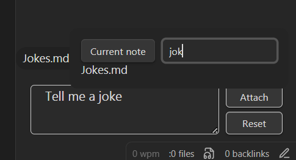
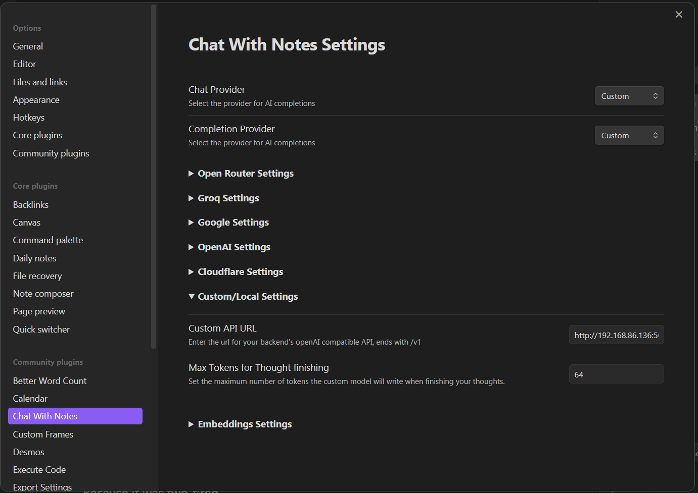

## Chat with Notes

This plugin adds a chat interface side bar, and an autocomplete hotkey within your notes. `Ctrl+Enter` lets the LLM complete your thought. The side bar is a basic chat interface with support for attaching notes as context. Right now only notes can be attached, not pdfs or other files in your vault.

A range of AI providers are supported, focusing on free providers. The free providers are:
- Open Router
- Google Gemini
- Groq
- Custom

With custom being any openai compatible url. I reccomend running koboldcpp or ollama locally for this, but any provider with an openai compatible API will work, e.g. Perplexity. Note: Not sure if perplexity will work since the model isn't specified.

If you want to use ChatGPT the official openai API is also supported.

Coming Soon:
- [ ] Image integration - using vision to interpret images in your notes, and image generation
- [ ] Embeddings for RAG
- [ ] Fixing the styling
